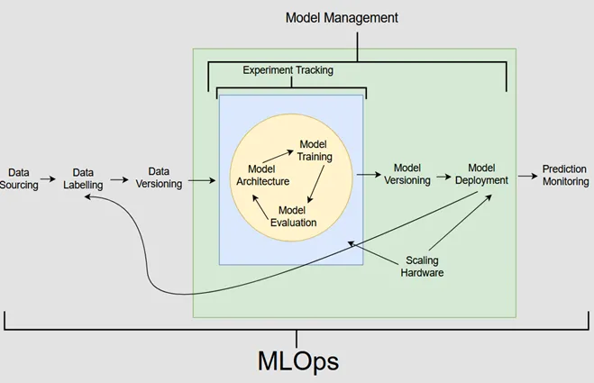

# MLOps_Zoomcamp 2024

<!-- This is a comment -->

Welcome to the Free  [MLOps](https://github.com/DataTalksClub/mlops-zoomcamp) course run by DataTalksClub This program is designed to take you through the journey of mastering MLOps over several months. It consists of seven modules, each building upon the last, culminating in a capstone project.

## Modules Overview

### Module 1: Introduction

- **What is MLOps?**
  Explore the fundamentals of MLOps, its importance, and how it integrates machine learning operations into the software development life cycle.

- **MLOps Maturity Model**
  Understand the stages of MLOps maturity and how to assess your organization's readiness for implementing MLOps practices.

- **Running Example: NY Taxi Trips Dataset**
  Dive into a practical example using the NY Taxi trips dataset to demonstrate the application of MLOps concepts.

- **Why Do We Need MLOps?**
  Learn about the challenges faced in traditional machine learning workflows and how MLOps addresses them.

- **Course Overview**
  Get a high-level view of what the course entails, including the topics covered and the skills you'll acquire.

- **Environment Preparation**
  Set up your development environment to follow along with the course materials and exercises.

- **Homework**
  Apply what you've learned through hands-on assignments to reinforce your understanding.

### Week 1: Notes, Code, and Assignment

Explore the materials and assignments for the first week of the course. This includes notes on the introduction to MLOps, code snippets, and the initial homework assignment.

[Week 1 Materials](https://github.com/Kaustbh/Mlops-ZoomCamp/tree/main/01_intro)

Source: towardsai.net, https://pub.towardsai.net/mlops-ruling-fundamentals-and-few-practical-use-cases-641f0a2f88c9

 
